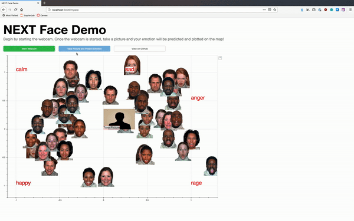

# NEXT Face Embedding Demo

This is a demo guesses the facial emotion of the user and maps it against a facial emotion map generate using NEXT.



## Run the demo

To run the webserver, download and run the docker image from docker hub at  `joeholt/next_face_demo:latest`:

``` shell
docker run -p XXXX:5006 joeholt/next_face_demo:latest
```

This will launch a webserver listening on port XXXX of your local machine.

## Development Requirements

1. Download Anaconda
2. Install dlib (instructions for install: https://github.com/ageitgey/face_recognition#installation-options)
3. Run `pip install requirements.txt`
4. Run `bokeh serve face_demo/main.py`
